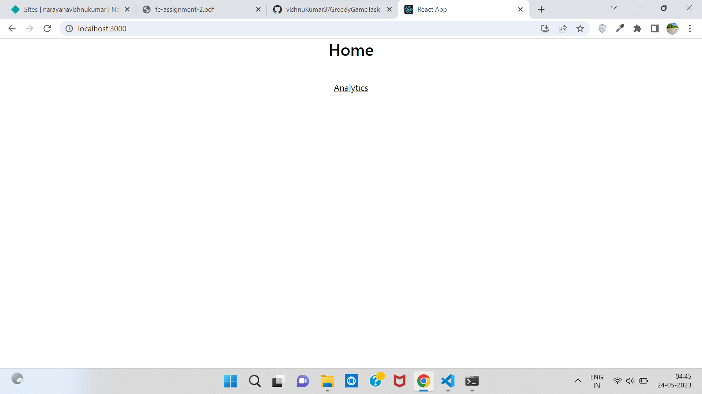

<h2>Greedy Game FE Task</h2>
<i>Here I implemented all the functionalities which are assigned</i>
<h3>List of functionalities implemented</h3>
<ul>
	<li>Table without any 3rd party library</li>
	<li>React+Redux</li>
	<li>Reuable data cache layer using redux</li>
	<li>Reorderable table columns</li>
	<li>Data formatting</li>
	<li>Sorting</li>
	<li>Searching</li>
	<li>Enable/Hide a particular column</li>
	<li>Included all the calculations like Fill rate and CTR
</ul>
<h3>Home Page</h3>

<h3>Analytics Page</h3>
